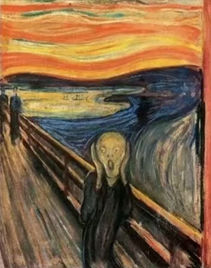
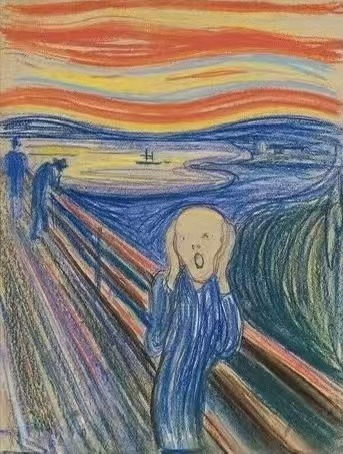
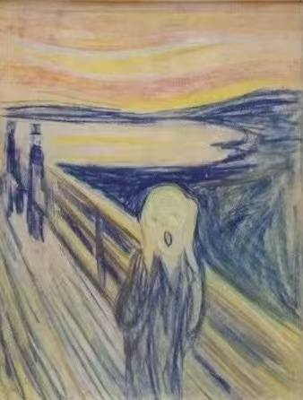
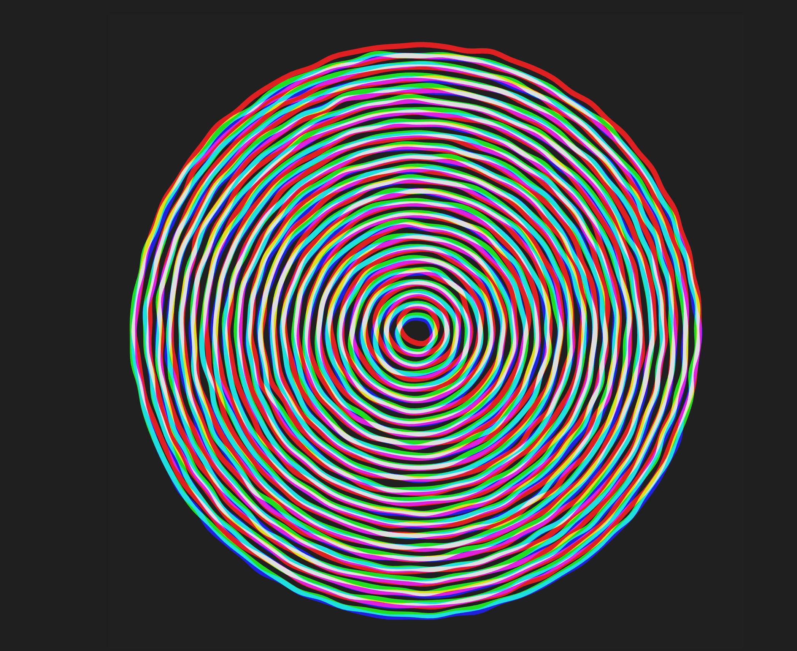

# jzho0010_9103_tut2  
# Individual Task — *The Scream: Time-Based Interpretation*  

---

## Overview
For my individual extension, I chose the Time-Based animation method.
My idea was to reinterpret The Scream not as a static moment, but as an emotional cycle flowing through an entire day. The environment shifts from day to night, and the “scream” grows more intense as darkness deepens.
While preserving the group’s visual foundation, I introduced a timeline system where color, light, and distortion evolve to reflect different emotional states across time.

## Inspiration
### Munch’s Four Versions  
Edvard Munch created four different versions of The Scream, each with unique palettes and emotional intensities. This inspired me to treat the artwork as something fluid.
My animation cycles through day → evening → night → dawn, echoing how Munch revisited the scene with different moods.

  
   
  
  

### Impressionist Light & Color  
Like Monet’s studies of Rouen Cathedral, I wanted the background colors to respond to time itself.
The sky and water shift between warm daylight tones and deep nocturnal hues, reflecting how Impressionists captured different moments under different light.

### The “Nighttime Effect”
Research shows that feelings of anxiety and sadness intensify at night due to reduced sensory distractions and increased introspection (e.g., studies from Journal of Affective Disorders, 2017).
This concept shaped the animation logic:

·*Day*: Scream rings smaller and calmer

·*Night*: Rings expand, distort, and “overflow”

## Animation Design & Features  
### The “Scream Rings”
I replaced the static lines with dynamically wobbling circular rings surrounding the figure’s head.

·*Concept*: a “breathing” emotional halo

·*Technique*: Perlin noise distortion + lerpColor transitions

·*Reference*: adapted from this OpenProcessing sketch

[Wobbly Circles RGB](https://openprocessing.org/sketch/2388698)

  

### Environmental Transitions
A global getTimeProgress() function drives a full 16-second day–night cycle:

·*Sky*: orange → deep blue

·*Water*: brighter cyan → muted ink-green

·*Bridge*: whites dim into grey

·*Character*: skin tone darkens at night

### Changes from Group Code  
The original group structure remains. My additions include:

·Added day–night cycle function

·Applied color interpolation for sky, water, bridge, and character

·Added drawWobblyRing() for noise-based scream rings

### Technical Info  
Interaction: none — animation loops automatically

Cycle: 0–8s (day→night), 8–16s (night→day)

Tools: p5.js, Perlin noise, sin/cos geometry, lerp/lerpColor
